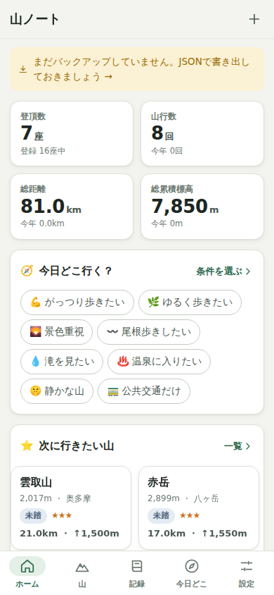
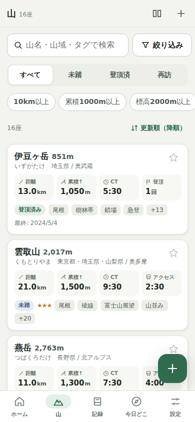
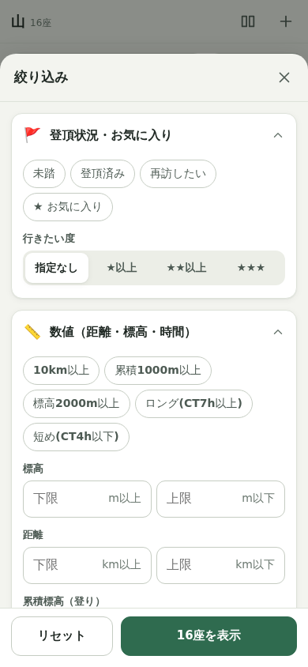
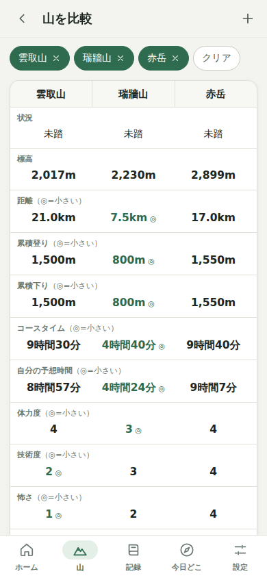
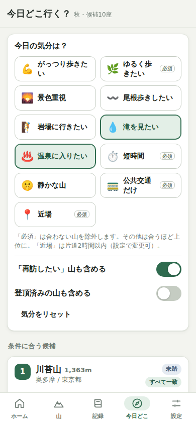
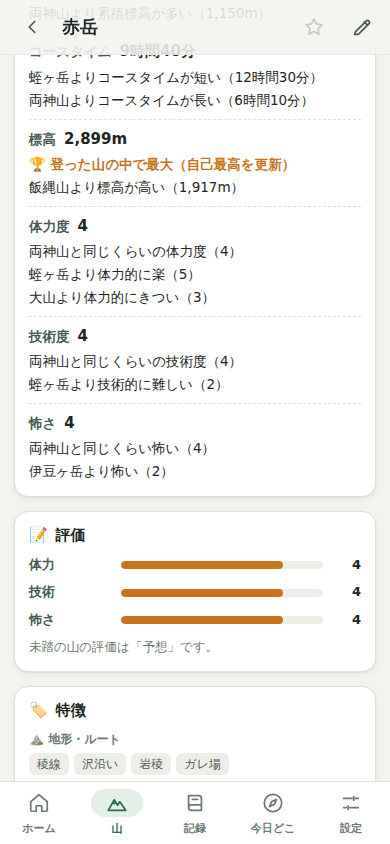
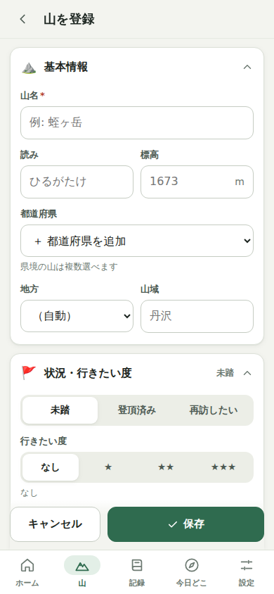
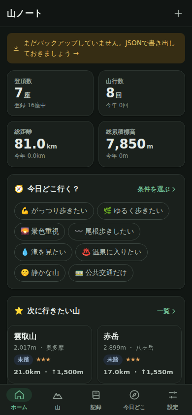

# 山ノート — 自分専用の登山データベース

スマートフォン最優先の、**自分専用の登山管理・山選び Web アプリ（PWA）**です。
単なる登山記録帳ではなく、これまでの登山経験を蓄積し、その情報を使って **次に登る山を探す・比べる・選ぶ** ことを目的にしています。

- 登った山を記録する（1つの山に何度登っても、山行記録は別々に残る）
- 未踏・今後登りたい山を管理する（行きたい度・お気に入り・予想評価）
- 自分の経験や好みを使って、次に登る山を比較・提案する

アカウント登録・外部 API は不要。データは端末内（IndexedDB）に保存し、オフラインでも主要機能が使えます。

| ホーム | 山一覧 | 絞り込み | 比較 | 今日どこ行く？ |
| --- | --- | --- | --- | --- |
|  |  |  |  |  |

| 既登山との比較 | 山の登録フォーム | ダークモード |
| --- | --- | --- |
|  |  |  |

---

## 起動方法

Node.js 20 以上を想定しています。

```bash
npm install
npm run dev        # 開発サーバー（http://localhost:5173）
npm run build      # 型チェック + 本番ビルド（dist/）
npm run preview    # ビルド結果を http://localhost:4173 で配信（Service Worker も有効）
```

- `dist/` は静的ファイルだけで動くので、GitHub Pages / Netlify / Cloudflare Pages などにそのまま置けます（ハッシュルーティング・相対パス対応）。
- スマホで使うときは、公開した URL を開いて **ホーム画面に追加**（iPhone: Safari の共有 →「ホーム画面に追加」、Android: Chrome のメニュー →「アプリをインストール」）。
- 初回起動時に「サンプルデータで試す」を押すと、16座・8件の山行記録で操作感を確認できます（設定からいつでも一括削除可能）。

### テスト

```bash
npm test                  # 単体テスト（Vitest）
npm run test:e2e          # ブラウザ E2E テスト（Playwright / iPhone 13 相当の画面）
# 事前インストール済みの Chromium を使う場合
CHROMIUM_PATH=/path/to/chromium npm run test:e2e
npm run icons             # public/icons/icon.svg から PWA 用 PNG を再生成
```

---

## 実装した機能

### 山と山行記録（分離したデータ構造）
- **山**: 山名・読み・地方・都道府県（県境の山は複数可）・標高・山域・登頂状況（未踏 / 登頂済み / 再訪したい）・お気に入り・行きたい度（0〜3）・メモ・リンク・特徴タグ・評価・アクセス時間
- **コース**: 山ごとに複数登録可。先頭が「代表コース」（名称・スタート/ゴール・距離・累積登り/下り・標準コースタイム）
- **山行記録**: 登山日（泊まりは最終日も）・登頂/撤退・コース名・スタート/ゴール・距離・累積登り/下り・所要時間・標準コースタイム・**自分のペース（自動計算）**・天候・気温・路面状況・混雑・交通手段・装備・同行者・感想・評価・この山行のタグ
- **縦走対応**: 1つの山行記録に複数の山を紐づけ可能
- 山行を記録すると、未踏の山は自動で「登頂済み」に（撤退記録は未踏のまま）
- 写真・GPS ログ・位置情報用のフィールドを予約済み（`photos` / `track` / `location` / `ext`）

### 特徴タグ（カテゴリ別・拡張可能）
- **15カテゴリ・159タグのプリセット**: 地形・ルート / 技術要素 / 景観 / 山行スタイル / 季節適性 / 体力要素 / 技術難度 / アクセス / 施設 / 下山後・周辺の楽しみ / 混雑傾向 / 危険・注意要素 / 山そのものの特徴 / 選定・称号 / 個人的な好み
- タグもカテゴリも **コードに固定せずデータとして DB に保存**。プリセットの名前変更・非表示・並べ替え、カスタムタグ/カテゴリの追加・編集・削除が可能
- 入力フォームからその場でカスタムタグを追加できる。検索用の別名（例: 温泉 ⇔ 日帰り湯）にも対応
- 山のタグ ＋ 山行記録のタグの両方が検索対象

### 数値とタグの分離
距離・累積標高・標高・コースタイム・アクセス時間は数値で保存し、「10km以上」「累積1000m以上」「標高2000m以上」「ロング（CT7h以上）」などの範囲条件で絞り込めます。
数値は「代表コース」を優先し、未登録なら最新の山行記録の値を使います（画面に出どころを表示）。

### 自分の評価（7軸・5段階）
体力 / 技術 / 怖さ / 景色 / 楽しさ / また行きたい度 / 自分との相性 を別々に評価。
「長いけれど技術的には易しい」「短いけれど岩場が怖い」を表現できます。
未踏の山には「予想評価」を入れておけ、登頂後は山行記録の評価平均で補完されます。

### 検索・絞り込み・並び替え
- 山名・読み（ひらがな/カタカナ/全角半角・「ヶ/ケ」を同一視）・山域・コース名・タグ名・別名のフリーワード（スペース区切り AND）
- 登頂状況・お気に入り・行きたい度・地方・都道府県・山域・標高/距離/累積標高/コースタイム範囲・アクセス時間・評価の上下限
- タグは「すべて含む（AND）/ いずれか（OR）」、タップで **含む → 除外 → 解除**（例: クマを除外）
- 例: 「未踏」＋「公共交通向き」＋「尾根」＋「累積1000m以上」＋「温泉」
- 並び替え: 更新順・山名・標高・距離・累積標高・コースタイム・登山日・登った回数・自分の評価（総合）・また行きたい度・行きたい度・各評価軸（昇順/降順）
- 条件は画面遷移しても保持

### 山の比較（2〜3座）
標高・距離・累積登り/下り・コースタイム・**自分のペースでの予想時間**・体力度・技術度・怖さ・景観・楽しさ・アクセス（時間/手段）・主な特徴・危険要素・下山後/施設・季節・混雑を並べて表示。有利な値に ◎。

### 自分の既登山を基準にした比較
山の詳細・比較画面で「**蛭ヶ岳より距離が短い**」「**両神山より技術的に易しい**」「**飯縄山と同じくらいの距離**」「標高は自己最高を更新」のように、自分が登った山を「ものさし」にして表示します（距離・累積標高・コースタイム・標高・体力度・技術度・怖さ）。

### 今日どこ行く？
- 気分: がっつり歩きたい / ゆるく歩きたい / 景色重視 / 尾根歩きしたい / 岩場に行きたい / 滝を見たい / 温泉に入りたい / 短時間 / 静かな山 / 公共交通だけ / 近場
- 「必須」の気分（ゆるく・短時間・公共交通・近場）は合わない山を除外、その他は合うほど上位
- 季節（今の季節向きのタグ）・行きたい度・また行きたい度も加味
- 候補ごとに **選んだ理由**、自分のペースでの予想時間、危険要素・データ不足の注意を表示
- 「滝は無いが渓流はある」などは「一部一致」として下位に表示

### ホーム
登頂数・山行数・総距離・総累積標高（今年分も）、今日どこ行く？（気分をワンタップ）、次に行きたい山、最近の山行、未踏候補、お気に入り、統計（最高到達点・自分のペース・年別山行数・標高帯分布）、バックアップのリマインド。

### データ管理（消失対策）
- **JSON エクスポート**（ダウンロード / 対応端末では共有メニューからファイル保存）
- **JSON インポート**（「統合」: 更新日時が新しい方を採用 / 「置き換え」）。内容のプレビュー、壊れた項目のスキップ、未来のフォーマットの検出
- **端末内バックアップ**: 1日1回の自動スナップショット（最大7件）、手動バックアップ、インポート前・リセット前の自動バックアップ、任意の時点への復元・ダウンロード
- 永続ストレージ（`navigator.storage.persist`）を要求し、ブラウザによる自動削除を防止
- 最終エクスポートから30日以上経つとホームに警告

### UI
- スマホ最優先のカード型 UI、下部タブナビ（PC 幅では左レール）、片手で届く位置の追加ボタン
- タップ領域 44px 以上、入力は 16px 以上（iOS の自動ズーム防止）
- 長いフォームは折りたたみセクションに分割、絞り込みはボトムシート
- ライト / ダーク / 端末設定に追従
- PWA（manifest・Service Worker によるオフライン起動・ホーム画面追加）

---

## ファイル構成

```
index.html                 エントリ HTML（テーマのちらつき防止スクリプト含む）
vite.config.ts             ビルド設定（Service Worker 生成プラグイン含む）
playwright.config.ts       E2E テスト設定（iPhone 13 相当）
public/                    manifest・アイコン
scripts/gen-icons.mjs      SVG → PNG アイコン生成
e2e/                       ブラウザ E2E テスト
docs/screenshots/          画面キャプチャ
src/
  main.tsx                 起動（Repository 選択・SW 登録）
  sw-template.js           Service Worker のテンプレート
  domain/                  ★ UI から独立した純粋ロジック（すべて単体テスト対象）
    types.ts               データモデル（Mountain / Course / ClimbRecord / Tag / TagCategory / Settings / ChangeSet）
    presets.ts             プリセットのカテゴリ・タグ定義（安定ID）
    tags.ts                タグ索引・プリセット補完・削除時の参照整理
    mountain.ts            山の派生情報（MountainView）・ペース・予想時間
    record.ts              山行記録・ペース計算・選択肢
    ratings.ts             評価軸の定義・平均・総合点
    filter.ts              検索・複数条件絞り込み・並び替え
    compare.ts             比較表の組み立て
    benchmark.ts           既登山を基準にした比較文の生成
    stats.ts               ホームの統計
    suggest/               「今日どこ行く？」提案エンジン（Suggester インターフェース＋ルールベース実装）
    geo.ts / format.ts / util.ts
  data/                    永続化
    repository.ts          Repository インターフェース
    idbRepository.ts       IndexedDB 実装（idb）
    memoryRepository.ts    メモリ実装（テスト・フォールバック用）
    exportImport.ts        JSON 形式・sanitize・マイグレーション・マージ
    backup.ts              端末内スナップショット
    sample.ts              サンプルデータ
  state/
    store.ts               AppStore（ユースケース・ChangeSet 適用・派生データのキャッシュ）
    router.ts / ui.ts / hooks.ts
  ui/                      Preact コンポーネント
    App.tsx / theme.ts
    components/            カード・入力部品・タグ選択・シート/ダイアログ/トースト・アイコン
    pages/                 各画面
  styles/app.css           デザイントークン（ライト/ダーク）とスタイル
```

### 設計のポイント
- **山と山行記録を分離**し、検索・比較で使う値は `MountainView`（山＋記録から毎回計算、DB には保存しない）に集約。
- **タグはデータ**: カテゴリもタグも DB のエンティティ。プリセットは安定 ID（例 `terrain.ridge`）を持ち、ユーザーが名前を変えても提案ルールとの関連が切れない。プリセットを削除すると `hidden` として残るため、アプリ更新時の再シードで復活しない。新しいプリセットは `presets.ts` の配列に足して `PRESET_VERSION` を上げるだけで既存ユーザーにも追加される。
- **すべてのエンティティに `id` / `createdAt` / `updatedAt` / `ext`**。変更は `ChangeSet` 単位でアトミックに保存。インポートの「統合」は updatedAt ベースで、将来のクラウド同期と同じ方針。
- **Repository インターフェース**で保存先を抽象化（IndexedDB / メモリ）。クラウド同期版を差し替え可能。
- **提案エンジンは `Suggester` インターフェース**（非同期）。ルールベース以外（AI 提案など）を `suggest/index.ts` の登録に追加するだけで UI はそのまま使える。
- エクスポート形式は `format` 番号付き。スキーマ変更時は `migrate()` に変換を追加。IndexedDB も `DB_VERSION` と `upgrade` で段階的に移行。

---

## テスト結果

最終確認時点（2026-09-28）:

- **単体テスト（Vitest）: 9ファイル・56件すべて成功**
  - 時間表記の解析・表示、かな/全角の正規化
  - プリセット（ID の一意性・提案ルールが参照するタグの存在）
  - 山の派生情報（代表コース優先・記録で補完・縦走の扱い・評価の合成・タグの合成）、ペース
  - 検索・複数条件（仕様例の組み合わせ含む）・AND/OR/除外・評価の上下限・並び替え
  - 既登山基準の比較文・自己最高・比較表のハイライト
  - 提案（必須条件・複合条件・季節・部分一致・理由と注意）
  - JSON の往復・壊れたデータの sanitize・マージ・参照修復
  - AppStore＋IndexedDB（fake-indexeddb）: 初回シード、追加/編集/削除、**再読み込み後の復元**、山削除時の記録のカスケード、カスタムタグの追加/変更/削除、エクスポート→リセット→インポート、端末内バックアップの復元・自動バックアップの間引き、サンプルの追加/削除
- **E2E テスト（Playwright・iPhone 13 相当の Chromium）: 10件すべて成功**
  1. 山の追加（フォーム入力・タグ選択・その場でカスタムタグ追加）→ 詳細表示 → 再読み込み後も復元
  2. 山の編集・削除（再読み込み後も反映、記録のカスケード削除）
  3. 山行記録の追加（代表コースのコピー、ペース自動計算、未踏→登頂済み）
  4. 検索（カタカナ読み）・複数条件絞り込み（未踏＋公共交通＋尾根＋累積1000m以上、温泉の包含/除外）・並び替え
  5. 3座の比較（表・ハイライト・既登山基準の比較）
  6. 今日どこ行く？（理由付き候補・必須条件での絞り込み）
  7. JSON エクスポート → 全削除 → JSON インポート（置き換え・統合）、端末内バックアップ作成の確認
  8. 壊れた JSON のインポートでエラー表示・データ不変
  9. タグ管理（カスタムタグの追加・名前変更・削除）
  10. PWA: manifest の確認、Service Worker 経由で **オフラインでも起動**し提案まで動作
- **UI 確認**: 390×844（iPhone 相当）のスクリーンショットでホーム・一覧・絞り込み・並び替え・詳細・フォーム・記録・比較・今日どこ行く？・設定・タグ管理を確認。ダークモード、1280px（PC）でも確認。確認中に見つけた問題（狭い幅での数値の省略表示、ボトムシート内の折りたたみが潰れる、比較表の固定ヘッダーがずれる、部分一致の候補が「一致」と表示される等）は修正済み。

---

## 現在の制限

- データは **この端末のこのブラウザ内のみ**。別端末と共有するには JSON エクスポート/インポートを使う（自動同期なし）。
- ブラウザのサイトデータを削除すると、端末内バックアップも含めて消える（JSON エクスポートを推奨）。iOS Safari は長期間未使用のサイトデータを削除することがあるため、ホーム画面に追加して使うのが安全。
- 写真・GPS ログは未対応（データ構造のみ予約）。
- 天気・地図・交通・登山道情報などの外部データ連携はなし。距離やコースタイムは手入力。
- 提案はルールベース（タグ・数値・評価の登録が多いほど精度が上がる）。「近場」は各山に入力した片道アクセス時間で判定。
- サンプルデータの数値は一般的なコースの目安で、計画には最新の公式情報・地図を確認すること。

## 今後追加しやすい機能

- **写真**: `photos: PhotoRef[]` が山・記録にあり、IndexedDB に Blob ストアを追加するだけで保存可能
- **GPS ログ / 地図**: `ClimbRecord.track`（GPX/GeoJSON 参照）、`Mountain.location`（緯度経度）を予約済み。地図表示や距離・累積標高の自動計算に拡張可能
- **天気 API**: `ext` フィールドにキャッシュでき、「今日どこ行く？」のムードルールに天候条件を足せる
- **AI 提案**: `Suggester` を実装して登録するだけ（`SuggestionContext` から自分の既登山・評価・タグを要約してプロンプト化）
- **クラウド同期・ログイン**: `Repository` のクラウド実装＋ `ChangeSet` の送受信、`updatedAt` ベースのマージは実装済み
- **公共交通検索**: 山のアクセス情報（タグ・メモ・時間）を起点に連携
- 年間目標・達成率（百名山の進捗など）、山行の CSV 出力、タグの一括付け替え
